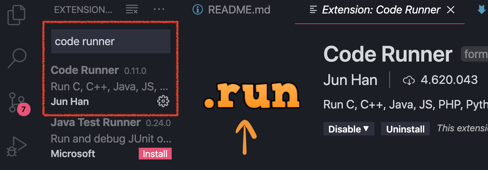

<p align="center"> Resolução de Problemas/Lógica aplicada e JavaScript <p>


## Sumário

1. **[Ambiente](#ambiente)**
2. **[Lógica](#lógica)**
3. **[Variáveis](#variáveis)**
4. **[Dados](#dados)**
5. **[Operadores](#operadores)**
6. **[Condicionais](#condicionais)**
7. **[Extra](#extra)**

----

## Ambiente


### O que é o node?

O Node.js pode ser definido como um ambiente de execução Javascript server-side, ou seja com o node usamos JavaScript do lado do servidor

### Já tem o node instalado?

Para checar digite na linha de comando:

`node --version`

Se tiver instalado vai aparecer a versão.
Caso não tenha, esse é o link para instalação: https://nodejs.org/en/download/

````> console.log("Hello World")````

### Pra rodar nossos códigos
Nós vamos rodar nossos códigos Js dentro do próprio VSCode com essa ferramenta: `Code Runner`



Depois de instalado é só rodar `ctrl+alt+n` no arquivo `.js`

----

# Lógica

<p align="center"> Objetivo <p>
Entender os princípios básicos de lógica de programação utilizando a linguagem JavaScript

### O que é um algoritmo

Em ciência da computação, um algoritmo é uma sequência finita de ações executáveis que visam obter uma solução para um determinado tipo de problema.

**Algoritmo é tipo uma "receita"** para executarmos uma tarefa ou resolver algum problema. Utilizamos algoritmos no nosso dia-a-dia para a execução de alguma tarefa ou até mesmo resolver algum problema.

Para fazer um computador fazer qualquer coisa, você precisa escrever um programa de computador. Para escrever um programa de computador, você tem que dizer ao computador, passo a passo, exatamente o que você quer que ele faça. O computador "executa" o programa, seguindo cada etapa mecanicamente, para atingir o objetivo final.

**Alguns exemplos de algoritmos que podemos citar: receitas culinárias, manual de instrução de aparelhos e funções matemáticas.**

|Dicas para o raciocícno lógico:
|--------------------------------
|**1** - Compreender o que é pedido --> Perca alguns minutos na leitura do enunciado do exercício
|**2** - Realizar deduções na construção do programa --> 
|a) Se chover, Silvana irá ao cinema. 
|b) Choveu! 
|Considerando que as informações são verdadeiras
|c) Silvana foi ao cinema!
|**3** - Enumerar as etapas a serem realizadas
|**4** - Considerar outras possibilidades de solução
|**5** - Ensinar ao computador uma solução
|**6** - Pensar em todos os detalhes


Pense na receita culinária, por exemplo. Ela tem os ingredientes necessários **(dados de entrada)**, passo a passo para realizar a receita **(processamento ou instruções lógicas)** e o prato finalizado **(saída esperada)**. 

Um algoritmo, portanto, conta com a entrada (input), com o processamento desses dados e saída (output) de informações.

As estruturas de um algoritmo são:

- **variáveis**: são as informações de entrada inseridas que determinam aonde o algoritmo poderá ir. As mais comuns são texto, inteiro, lógico e real;
- **comandos de repetição***: consiste no uso de “se” e “enquanto”, para que o algoritmo saiba o que fazer quando determinados processos ocorrerem e o que fazer se eles mudarem.

 

----

## Variáveis

O recurso utilizado nos programas para escrever e **ler dados da memória do computador** é conhecido como variável, que é simplesmente um espaço na memória o qual reservamos e damos um nome. Por exemplo, podemos criar uma variável chamada "idade" para armazenar a idade de uma pessoa. Você pode imaginar uma variável como uma gaveta "etiquetada" em um armário.


Toda vez que precisarmos armezanar e recuperar dados utilizaremos variáveis.

No Javascript temos 3 maneiras de usar variáveis:

- **var** --> Mais antigo.A grande peculiaridade de uma variável var é o escopo de sua atuação, ou seja, o limite de até onde ela será “enxergada”.uma variável declarada com var possui o que chamamos de escopo de função. Isso significa que se criarmos uma variável deste tipo dentro de uma função, sua referência poderá ser identificada e modificada em qualquer parte desta função, mesmo que criemos outros escopos dentro dela, como um bloco if(), switch() ou for(). Isso pode implicar alguns problemas.

- **let** --> Um variável declarada com let leva em conta, não a função onde foi criada, mas sim o bloco de código de sua origem. Isso significa que se a declararmos dentro de um if(), switch() ou for(), ela será “enxergada” apenas dentro desta parte do código, dentro deste escopo específico.

- **const** --> Entretanto, declarar uma variável como const não significa necessariamente que seu valor não pode ser mudado. Significa que não podemos sobrescrever o seu identificador.

|Resumindo as declarações
|-------------------------
|**var** -- Declara uma variável, opcionalmente, inicializando-a com um valor.
|**let** -- Declara uma variável local de escopo do bloco, opcionalmente, inicializando-a com um valor.
|**const** -- Declara uma constante de escopo de bloco, apenas de leitura.

Para mais infos:

https://hcode.com.br/blog/entenda-a-diferenca-entre-var-let-e-const-no-javascript

https://www.alura.com.br/artigos/entenda-diferenca-entre-var-let-e-const-no-javascript

```javascript
// tipos de variáveis 
const numero = 1 // número
const numero = "1" //string, nesse caso aqui podemos converter para numero 
//usando os métodos Number(), parseInt() e parseDouble()
const texto = "Javascript!!!" // string
```

Declarando variáveis

Um identificador JavaScript deve começar com: 
- uma letra
- underline (_)
- cifrão ($)

Os caracteres subsequentes podem também ser 
- números (0-9)
- letras incluem caracteres de "A" a "Z" (maiúsculos)
- caracteres de "a" a "z" (minúsculos)

Uma varivável não pode ser uma palavra reservada, [clique aqui para saber quais são:](https://developer.mozilla.org/en-US/docs/Web/JavaScript/Reference/Lexical_grammar#Keywords)

----

## Dados

#### String
é uma sequência de caracteres usados para representar texto.

```javascript
"Variáveis em Javascript são uma forma para se salconst dados"
"Isabelle"
"1 é um número ímpar"
```

#### Number
é um tipo de dado numérico. 

```javascript
1
20
300
4000
94863049863409863
```

#### Boolean
é um tipo de dado lógico que pode ter apenas um de dois valores possíveis: verdadeiro ou falso. 

```javascript
false
true
```

#### Null
representa um valor nulo ou "vazio".

```javascript
null
```

```javascript
const y = null;
console.log(y) // retorna null
```

#### undefined

```javascript
undefined
```

```javascript
const x;
console.log(x)
```

O javascript não tem o que chamamos de tipagem de dados que é literalmente descrever qual é o tipo dessa variável, o que ele faz é "entender/adivinhar" qual é o tipo de dados de determinada variável sem ela ter sido declarada no código escrito.

> Vamos aos programas e aos processamentos de dados

----

## Operadores 

#### Operadores de atribuição
O operador de atribuição básico é o igual (=), que atribui o valor do operando à direita ao operando à esquerda. Isto é, x = y atribui o valor de y a x.

##### Igual
```javascript
const y = 7;
const x = y; // x é igual à 7
```

#### Operadores Aritméticos

##### Adição (+)

```javascript
const y = 7;
const x = 3;
const resultado = y + x 
console.log(resultado) // 10
```

##### Subtração (-)

```javascript
const y = 5;
const x = 2;
const resultado = y - x 
console.log(resultado) // 3
```

##### Multiplicação(*)

```javascript
const y = 4;
const x = 5;
const resultado = y * x 
console.log(resultado) // 20
```

##### Divisão (/) 
O operador de divisão produz o quociente de seus operandos onde o operando da esquerda é o dividendo e o da direita é o divisor.


```javascript
const y = 10;
const x = 2;
const resultado = y / x 
console.log(resultado) // 5
```

##### Módulo (%)
O operador módulo retorna o resto inteiro da divisão de um numero pelo outro.

```javascript
const y = 10;
const x = 2;
const resultado = y % x 
console.log(resultado) // 0
```

#### Operadores de Comparação - Relacional e Igualdade

##### == Igual 
Retorna verdadeiro caso os operandos sejam iguais.	

```javascript
3 == var1
"3" == var1
3 == '3'
```

##### != Não igual	
Retorna verdadeiro caso os operandos não sejam iguais.	

```javascript
var1 != 4
var2 != "3"
```
##### === Estritamente igual 
Retorna verdadeiro caso os operandos sejam iguais e do mesmo tipo. Veja também Object.is e igualdade em JS.

```javascript
3 === var1
```

##### !== Estritamente não igual 
Retorna verdadeiro caso os operandos não sejam iguais e/ou não sejam do mesmo tipo.

```javascript
var1 !== "3"
3 !== '3'
```
*O double equals vai tentar nos ajudar na comparação, e ao notar que estamos tentando comparar tipos diferentes (string e number) ele vai tentar converter a string para number. No caso acima ele consegue e por isso temos o resultado true.*

Entao por baixo dos panos o que aconteceu foi:
``2 == Number("2") //true``

*Com o triple equals o javascript nunca tenta converter os valores. Por isso, o resultado false.*

Sendo assim, __recomenda-se usar o triple equals__ para evitar surpresas.

E a internet não perdoa as surpresas:


##### > maior que
O operador de Maior retorna true se o operando da esquerda for maior que o operando da direita.

```javascript
4 > 3 // true
```

##### >= maior ou igual a
O operador maior ou igual retorna true se o operando da esquerda for maior ou igual ao operando da direita.

```javascript
4 >= 3 // true
3 >= 3 // true
```

##### < menor que
O operador menor retorna true (verdadeiro) se o operando da esquerda for menor que o operando da direita.

```javascript
3 < 4 // verdade
```

##### <= menor ou igual a
O operador menor ou igual retorna true (verdadeiro) se o operando da esquerda for menor ou igual ao operando da direita.

```javascript
3 <= 4 // verdade
```

#### Operadores Lógicos

##### && (and) E lógico 
Indica conjunção. Retorna verdadeiro se todas as comparações forem verdadeiras.Se o primeiro valor for verdadeiro, ou puder ser considerado ou convertido pra verdadeiro retorna o segundo valor.

Se o primeiro valor for falso, retorna falso.

```javascript
true && "oi" // "oi"
"oi" && true // true
true && false // false
```


##### || (or) Ou lógico 
Indica disjunção. Retorna verdadeiro se no mínimo uma das condições definidas dor verdadeira. Se o primeiro valor for verdadeiro, ou puder ser considerado ou convertido pra verdadeiro retorna o primeiro valor.

Se o primeiro valor for falso, retorna o segundo valor.

```javascript
false || true // true
false || false // false
false || "oi" // "oi"
false || 0 // 0
```

##### ! (not) Não lógico 
Esse operador inverte o valor de uma expressão

Obs: Se um valor pode ser convertido para verdadeiro, este valor é chamado de truthy. Se um valor pode ser convertido para falso, este valor é chamado de falsy.

Exemplos de expressões que podem ser convertidas para falso são:

- null;
- NaN;
- 0;
- string vazia (""); 
- undefined.

Todos os outros são considerados verdadeiros.

```javascript
!true // false
!false // true
!'Oi' // false
!'' // true
```

----

## Condicionais

Usamos para verificar uma condição e definir se algo deve ou não acontecer a partir da condição dada.

É a linguagem que utilizamos para nos comunicar, repare:

Se amanhã fizer sol, vou viajar para a praia.

Temos uma condição (Se amanhã fizer sol) para executar uma ação (viajar para a praia) dependendo do resultado dessa condição. Se verdadeira, a ação é executada.

#### Expressões condicionais simples

```javascript
// Variável booleana verdadeira
const sol = true;

// Condição
if ( sol ) {
	// Ação
	console.log('Vou viajar para a praia!');
}
```

#### Estrutura if / else


```javascript
// Variável booleana verdadeira
const sol = false;

// Condição
if ( sol ) {
	// Ação
	console.log('Vou viajar para a praia!');
}else{
	// Ação
	console.log('Vou ao cinema');
}
```


#### Estrutura if / else if / else

```javascript
// Variável booleana verdadeira
const hora = 8;

// Condição
if ( hora <= 12 ) {
	// Ação
	console.log('Bom dia');
}else if( hora <= 18){
	// Ação
	console.log('Boa tarde');
}else{
	// Ação
	console.log('Boa noite');
}
```

```javascript
if ( condição ) {
	// Ação
} else if ( outra condição ) {
	// Ação
} else if ( outra condição ) {
	// Ação
} else if ( outra condição ) {
	// Ação
} else if ( quantas condições quiser ) {
	// Ação
} else {
	// Ação final se nenhuma condição for verdadeira
}
```

## Operador ternário

Existe ainda um aforma abreviada para criar as instruções if..else. Operador ternário (três operando) ou operador condicional. Ele consiste em realizar uma atribuição para uma variável com basse na análise de uma condição.

```java
var categoria = idade >=18?  "Adulto": "Juvenil"; 
/*a condiçõo deve ser inserida logo após o (=).O primeiro valor após a ?
é atribuido a variável caso a condição seja verdadeira.
E o segundo, após os : , caso a condição seja falsa */

if (idade >=18){
    var categoria = "Adulto";
}else{
    var categoria = "Juveil";
}

```

## Extra

Para pegar inputs no terminal precisamos baixar o `readline-sync`

Para confirmar que o npm está instalado, você pode executar este comando no seu terminal:

```
npm -v
```
O npm é um gerenciador de pacotes para a linguagem de programação JavaScript. 

Instale o `readline-sync`

```
npm install readline-sync
```

Coloque essa linha no topo do arquivo do seu código:

```
const input = require("readline-sync");
```

Exemplo:

```javascript
const readlineSync = require('readline-sync');
 
// Para .
const nome = readlineSync.question('Qual o seu nome? ');
console.log('Oi ' + nome + '!');
 
// Texto secreto (por exemplo, senha).
const comidaPreferida = readlineSync.question('Qual a sua comida preferia? ', {
  hideEchoBack: true // O texto digitado na tela está oculto por `*`.
});
console.log(nome + ' ama ' + comidaPreferida + '!');
```

Saída
```
Qual o seu nome? Isabelle
Oi Isabelle!
Qual a sua comida preferia? ****
Isabelle ama batata frita!
```